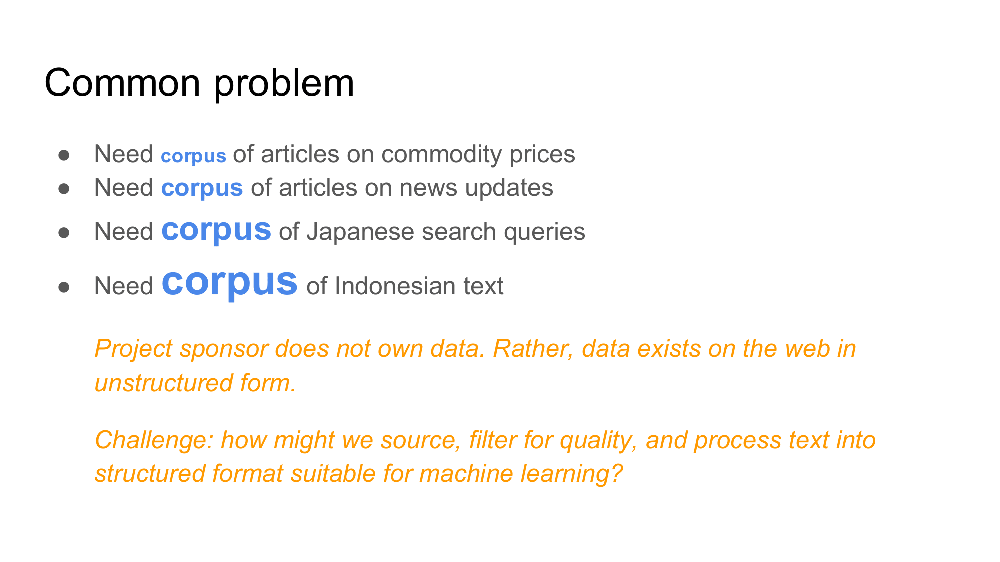
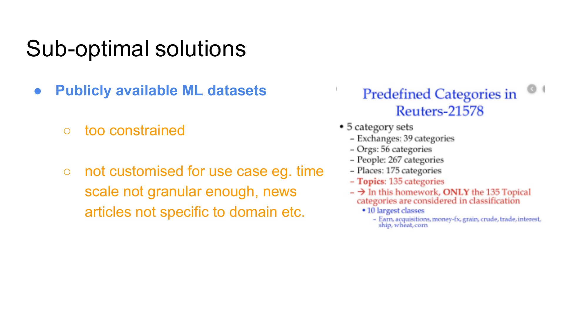
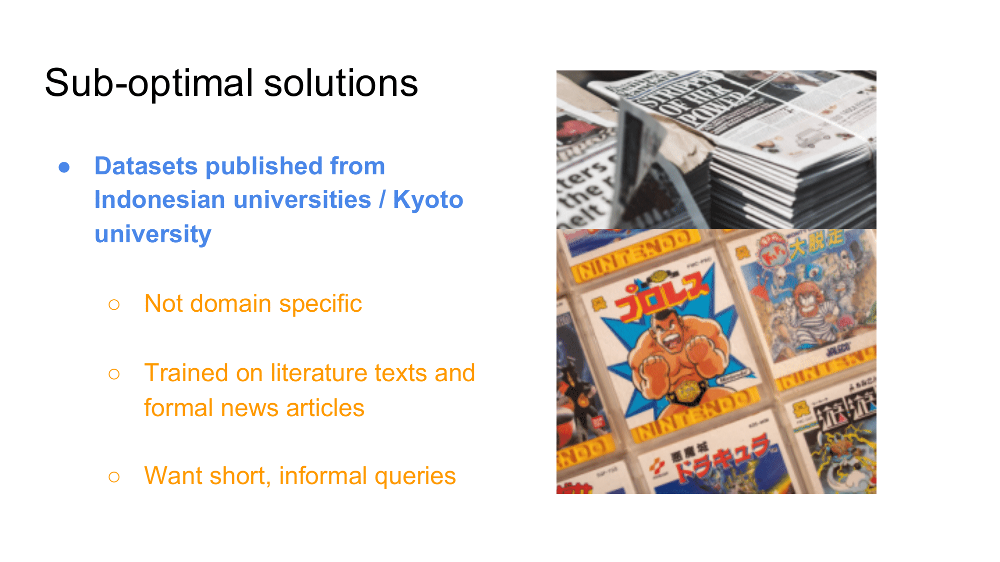
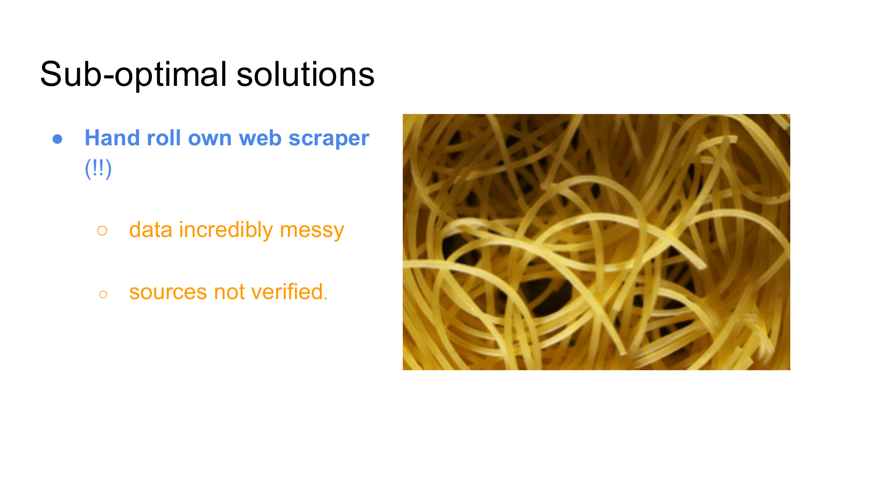
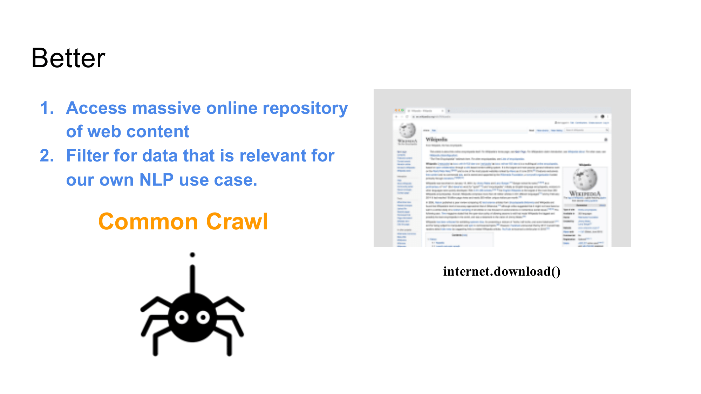
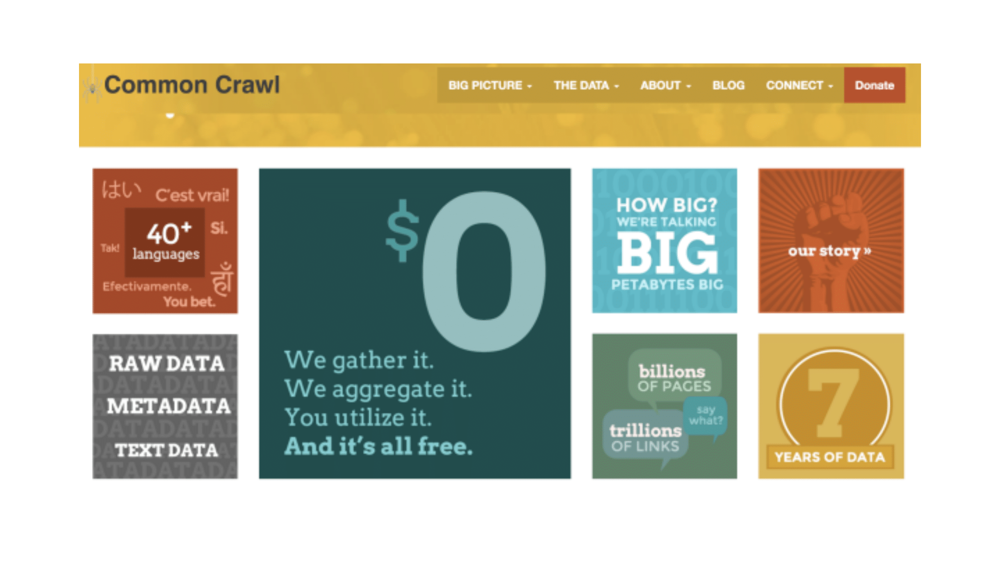
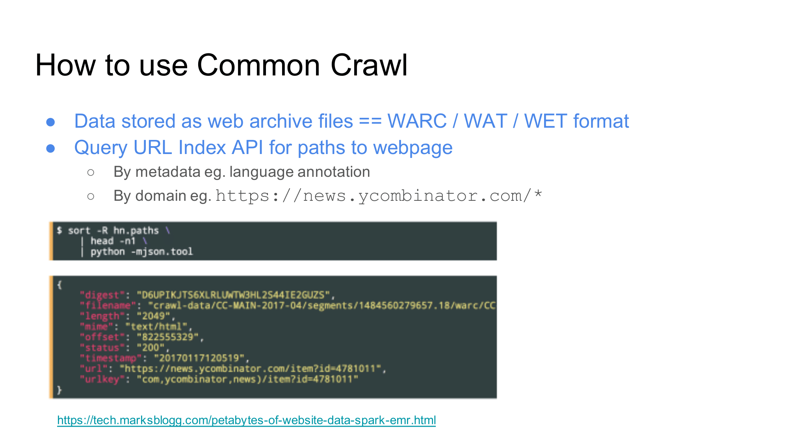
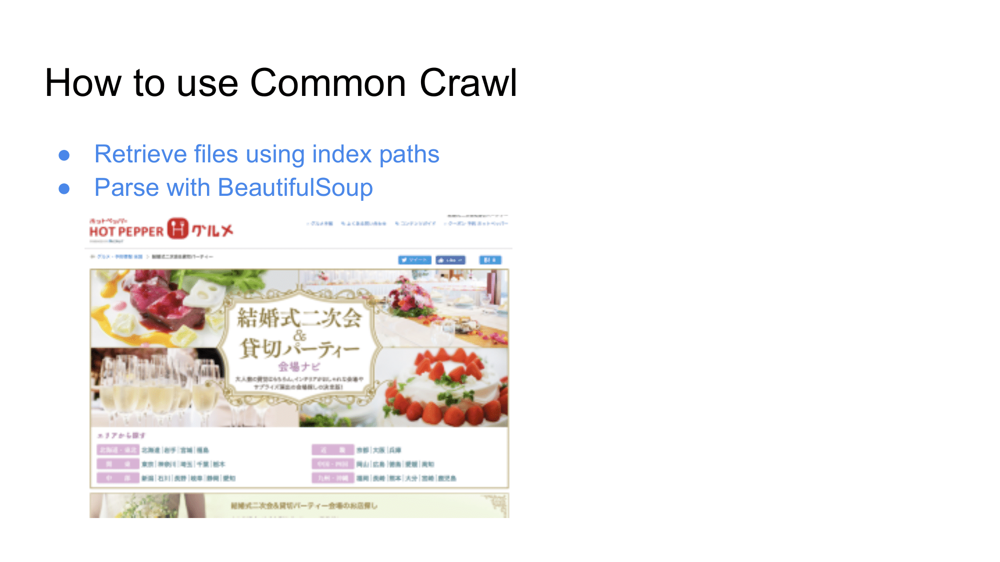
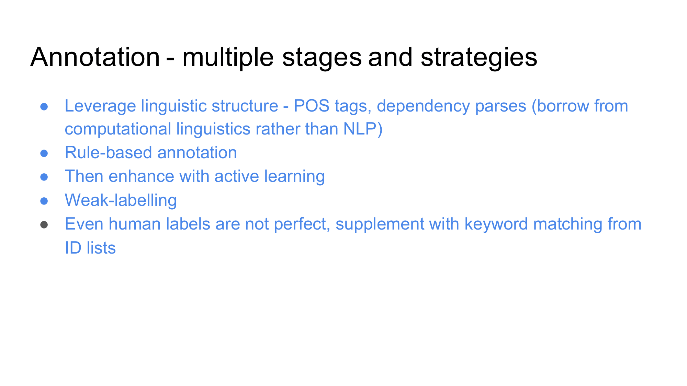

# common-crawl-toolkit
toolkit for building custom corpuses from Common Crawl data 

# Introduction
I've faced one problem common to all projects I've taken on as an AI Engineer, whether that problem is understanding market sentiment towards commodity prices, tagging news articles to multiple labels or building language models for languages such as Indonesian: a lack of a corpus that's customised to the problem we want to solve. The following few slides outline various approaches I've looked at and why I chose Common Crawl as a primary source of data. 

